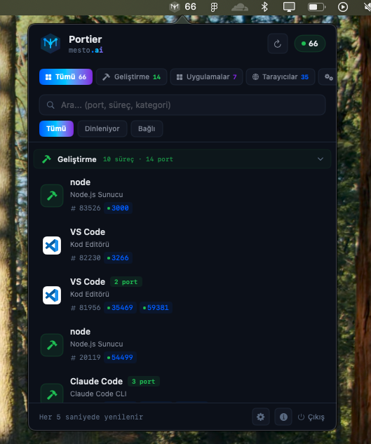

# Portier

> macOS menu bar app that monitors active network ports and processes in real-time.

<p align="center">
  
</p>

<p align="center">
  <strong>by <a href="https://github.com/mesto-ai">mesto.ai</a></strong>
</p>

## Demo

<video src="https://github.com/mesto-ai/portier/raw/main/assets/portier.mp4" width="400" autoplay loop muted></video>

## Features

- **Real-time Monitoring** — Auto-refreshes every 5 seconds
- **Smart Categories** — Development, Applications, Browsers, Infrastructure, System
- **Process Management** — Kill processes directly from the menu bar
- **Port Details** — See port, protocol, state, and address for each process
- **Quick Browser Access** — Open web-accessible ports in your browser with one click
- **Search & Filter** — Filter by port number, process name, or category
- **Bilingual** — Turkish and English language support
- **Dark Mode** — Follows your system preference or toggle manually

## Requirements

- macOS 13.0 (Ventura) or later
- Swift 5.9+

## Build & Run

```bash
# Clone
git clone https://github.com/mesto-ai/portier.git
cd portier

# Build
swift build

# Run
.build/debug/PortMonitor
```

## Project Structure

```
portier/
├── Package.swift          # Swift Package Manager config
└── PortMonitor/
    ├── App.swift           # App entry point & menu bar setup
    ├── PortMonitorView.swift # Main port list UI
    ├── PortService.swift   # Port scanning & process detection
    ├── SettingsView.swift  # Settings (theme, language)
    ├── AboutView.swift     # About page
    ├── Localization.swift  # TR/EN translations
    ├── Theme.swift         # Mesto design system
    ├── MestoLogo.swift     # Animated logo component
    └── Info.plist          # App configuration
```

## How It Works

Portier uses `lsof` to scan active network connections, then categorizes each process and presents them in a clean, grouped interface accessible from your menu bar.

## License

MIT © [mesto.ai](https://github.com/mesto-ai)
